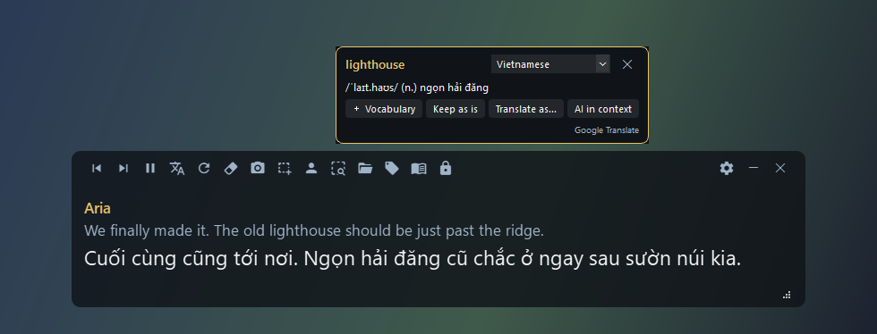

# Game Sub

**English** · [Tiếng Việt](README.vi.md)

[](https://github.com/GnuhViet/game-sub/releases)
[](https://github.com/GnuhViet/game-sub/releases)
[](LICENSE)


A live subtitle overlay that translates game dialogue as it appears on screen, for any game, using **screen OCR only**.
No hooking, no memory reading, no game file changes, so it's safe to use with online games that run anti-cheat.

Made with Vietnamese players in mind: it prefers your own fan-translation subtitle pack, falls back to Google Translate or Gemini,
and lets you click any word to look it up and save it for review.



## Features
- **Live dialogue translation**: select the dialogue box once; new lines are OCR'd and translated automatically. Typewriter text is read only after it stops changing.
- **Your subtitle pack first**: import CSV / TSV / TXT / XLSX / JSON and pick the source and translation columns. Exact → fuzzy → per-sentence matching, with player-name placeholders and gendered macros.
- **Machine translation fallback**: Google Translate (free) or Gemini (free API key), with previous lines as context, streaming output and automatic fallback on quota errors.
- **Glossary**: keep names and terms as-is or force a translation; terms are protected with Google Translate too.
- **Click-to-look-up**: click or select any word in the source line. Offline StarDict / TSV dictionaries, Google, dictionaryapi.dev, or an AI explanation in context.
- **Vocabulary book**: save words with their sentence, review them as flashcards, export to CSV / Anki.
- **Capture & translate** any area once (letters, menus, item descriptions) in a separate window; sentences that match the subtitle pack use it, the rest are machine-translated.
- **Overlay that stays out of the way**: click-through, lock, auto-hide when dialogue ends, hidden from screenshots, restylable.
- **Self-updating**: one click downloads the new release and keeps all your data.
- UI in **English** and **Tiếng Việt**; adding a language is a single JSON file.

## Download & quick start
1. Download `GameSub.zip` from [Releases](https://github.com/GnuhViet/game-sub/releases) and **extract everything** to a writable folder (e.g. `D:\GameSub`, not Program Files).
2. Run `GameSub\GameSub.exe`. It lives in the system tray.
3. Set the game to **Borderless / Windowed** and turn off dialogue auto-play.
4. Press `Ctrl+Alt+R` (or the region button) and drag a box around the dialogue text.
5. Optional: import a subtitle pack (📂) and add a Gemini key in Settings → Translation.

The exe ships with **Windows OCR** (needs the English language pack, usually already installed). RapidOCR and Tesseract can be downloaded in Settings → OCR.

## Updating
Click **Check for updates** at the bottom of Settings or in the tray menu. To be notified automatically,
turn on "Check for updates on startup" in Settings → Appearance (off by default).
**Update** downloads the release, verifies its SHA256, closes the app, replaces the program files and reopens it.
`data\` (settings, subtitle packs, glossary, vocabulary) and `engines\` (downloaded OCR) are never touched.

## Hotkeys
| Hotkey | Action |
|---|---|
| `Ctrl+Alt+R` | Select the dialogue area |
| `Ctrl+Alt+Q` | Capture & translate any area once |
| `Ctrl+Alt+T` | Show / hide the overlay (or click the tray icon) |
| `Ctrl+Alt+P` | Pause |
| `Ctrl+Alt+S` | Rescan |
| `Ctrl+Alt+D` | Translation on / off (off = source text only, for word lookup) |
| `Ctrl+Alt+C` | Click-through: the mouse goes through the overlay to the game |
| `Ctrl+Alt+L` | Lock the overlay; hold **Alt** to use it while locked |
| `Ctrl+Alt+X` | Clear the overlay |

To change a hotkey, click its field in Settings → Hotkeys and press the new combination. The toolbar appears when you hover the overlay:
drag the background to move it, drag the bottom-right corner to resize it, and use ◀ ▶ to go back through previous lines.
Buttons that don't fit on a narrow overlay move into the ☰ menu. Only one copy of Game Sub runs at a time. You can also select a **speaker name area**.

## How translation works
```
OCR → subtitle pack (exact → fuzzy → per sentence) ── match ──→ your translation
                                                    └ no match ─→ Google / Gemini / Gemini → Google
```
- **Subtitle packs:** placeholders like `{PlayerName}` are replaced with your character name (Settings → Characters),
  `{Male=..;Female=..}` is resolved by gender and `<color=..>` tags are stripped. Files imported later win on duplicate lines.
- **Gemini:** get a free key at [aistudio.google.com](https://aistudio.google.com). The default model is `gemini-2.5-flash-lite` with thinking budget 0 for low latency.
  On a 429 (quota) error the provider rests for `cooldown_s` seconds and the next one takes over. The translation prompt is editable in Settings → Prompt.
- **Dialogue** and **captured areas** each have their own engine setting; captured areas can also be read by Gemini straight from the image.

## Word lookup
Click a word in the source line (or select a phrase) to see its meaning; ✕ or right-click closes the popup. Right-click a selection to
look it up, save it to the vocabulary book, add it to the glossary or ask the AI to explain it in context.

| Dictionary mode | Source |
|---|---|
| Offline → Google (default) | your dictionary files, then Google Translate; pick the target language in the popup |
| Google | Google Translate, with part of speech and phonetics |
| Offline only | your dictionary files: **StarDict** (`.ifo` + `.idx` + `.dict`/`.dict.dz`), TSV/CSV `word⇥meaning`, JSON `{word: meaning}` |
| Online | dictionaryapi.dev (English–English) |
| AI in context | Gemini, cached |

## Troubleshooting
- **Wrong area, black image, OCR not working, hotkeys ignored:** run `GameSub.exe --diag` and attach `data\diag.txt` + `data\diag_region.png` to an issue.
- **Small text:** raise "Upscale image before OCR" to 1.5–2 in Settings → OCR. "Save current region image for checking" shows exactly what is being read.
- **Hotkeys don't work in game:** if the game runs as administrator, Game Sub has to as well (tray menu → Restart as administrator).

## Building from source
Requires Windows 10/11 and Python 3.10+.
```
run.bat      # first run creates .venv and installs dependencies
build.bat    # packages dist\GameSub\GameSub.exe and dist\GameSub.zip
diag.bat     # self-check: DPI / multi-monitor, capture, OCR, hotkeys -> data\diag.txt
```
Tests:
```
python tests/test_core.py && python tests/test_capture_translate.py && python tests/test_ui_smoke.py && python tests/test_i18n.py
```
To release: bump `__version__` in `gamesub/__init__.py`, run `build.bat`, create a `vX.Y.Z` release and attach `dist\GameSub.zip`
(the file name must be exactly `GameSub.zip`, the updater looks for it). Screenshots: `python tools/screenshots.py en|vi`.

### Translating the UI
Each language is one file, `gamesub/locales/<code>.json`. Copy `en.json` to e.g. `ja.json`, change `"_name"` and translate the values;
the app picks it up automatically. Missing keys fall back to Vietnamese (`vi.json` has every key). Keep placeholders like `{n}` as they are.
`python tools/i18n_check.py` reports missing or extra keys and placeholder mismatches. Pull requests with new languages are welcome;
language files added by hand to an installed copy are replaced on update.

## License
[MIT](LICENSE) © 2026 Nguyễn Việt Hưng. The packaged exe bundles third-party libraries under their own licenses
(PySide6 / Qt: LGPLv3; Material Design Icons: Apache 2.0, see `gamesub/assets/mdi6-NOTICE.txt`; …).
