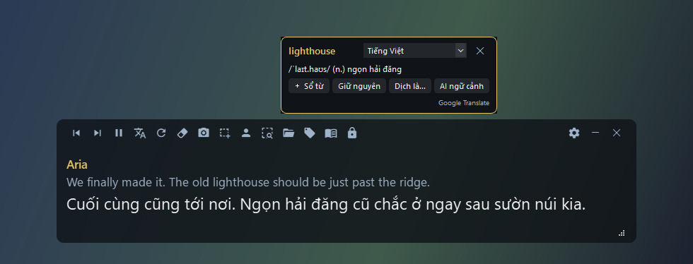

# Game Sub

[English](README.md) · **Tiếng Việt**

[](https://github.com/GnuhViet/game-sub/releases)
[](https://github.com/GnuhViet/game-sub/releases)
[](LICENSE)


Overlay dịch thoại game theo thời gian thực cho game bất kỳ, chỉ bằng **OCR màn hình**:
không hook, không đọc bộ nhớ, không sửa file game, nên dùng được cả với game online có anti-cheat.

Ưu tiên bộ sub Việt hóa của bạn, không khớp thì dịch bằng Google Translate hoặc Gemini.
Bấm vào từ bất kỳ để tra nghĩa và lưu vào sổ từ để ôn.



## Tính năng
- **Dịch thoại tự động**: chọn vùng thoại 1 lần, câu mới được OCR và dịch ngay. Chữ chạy từng ký tự thì đợi chạy xong mới đọc.
- **Ưu tiên bộ sub Việt hóa**: nhập CSV / TSV / TXT / XLSX / JSON, chọn cột gốc và cột dịch. Khớp chính xác → gần đúng → từng câu; hỗ trợ placeholder tên nhân vật và macro theo giới tính.
- **Dịch máy dự phòng**: Google Translate (miễn phí) hoặc Gemini (key miễn phí), có ngữ cảnh các câu trước, hiện chữ dần khi đang dịch, hết quota tự chuyển.
- **Glossary**: giữ nguyên tên riêng / thuật ngữ hoặc ép cách dịch; dịch bằng Google cũng được bảo vệ thuật ngữ.
- **Bấm từ để tra**: từ điển offline StarDict / TSV, Google, dictionaryapi.dev, hoặc AI giải nghĩa theo ngữ cảnh câu.
- **Sổ từ**: lưu từ kèm câu gốc, ôn bằng flashcard, xuất CSV / Anki.
- **Chụp & dịch** 1 vùng bất kỳ (thư, menu, mô tả vật phẩm) ra cửa sổ riêng.
- **Overlay không vướng víu**: click-through, khóa, tự ẩn khi hết thoại, ẩn khỏi ảnh chụp màn hình, đổi màu / cỡ chữ tùy ý.
- **Tự cập nhật**: 1 cú bấm là tải bản mới, giữ nguyên dữ liệu.
- Giao diện **Tiếng Việt** và **English**; thêm ngôn ngữ chỉ cần 1 file JSON.

## Tải về & bắt đầu
1. Tải `GameSub.zip` ở [Releases](https://github.com/GnuhViet/game-sub/releases), **giải nén hết** vào thư mục ghi được (vd. `D:\GameSub`, đừng để trong Program Files).
2. Chạy `GameSub\GameSub.exe` (đừng chạy thẳng trong zip). App nằm ở khay hệ thống.
3. Để game ở chế độ **Borderless / Windowed**, ngôn ngữ chữ **English**, tắt tự chạy thoại (Auto-play).
4. Bấm `Ctrl+Alt+R` (hoặc nút chọn vùng) rồi kéo khung quanh chữ thoại.
5. Tùy chọn: nhập bộ sub (📂), thêm key Gemini ở Cài đặt → Dịch.

Bản exe có sẵn **Windows OCR** (cần gói ngôn ngữ English trong Windows, thường có sẵn). RapidOCR và Tesseract tải trong Cài đặt → OCR.

## Cập nhật
Bấm **Kiểm tra cập nhật** ở góc dưới Cài đặt hoặc menu khay. Muốn app tự báo khi có bản mới:
bật "Tự kiểm tra bản mới khi mở app" ở Cài đặt → Giao diện (mặc định tắt).
Bấm **Cập nhật**: app tải bản mới, kiểm tra SHA256, tự tắt, thay file rồi mở lại.
`data\` (cài đặt, bộ sub, glossary, sổ từ) và `engines\` (OCR đã tải) giữ nguyên.

## Hotkey
| Hotkey | Chức năng |
|---|---|
| `Ctrl+Alt+R` | Chọn vùng thoại |
| `Ctrl+Alt+Q` | Chụp & dịch 1 vùng bất kỳ |
| `Ctrl+Alt+T` | Ẩn / hiện overlay (hoặc bấm icon khay) |
| `Ctrl+Alt+P` | Tạm dừng |
| `Ctrl+Alt+S` | Quét lại |
| `Ctrl+Alt+D` | Bật / tắt dịch (tắt = chỉ hiện câu gốc để tra từ, không tốn quota) |
| `Ctrl+Alt+C` | Click-through: chuột xuyên qua overlay để bấm game |
| `Ctrl+Alt+L` | Khóa overlay; giữ **Alt** để bấm trên overlay khi đang khóa |
| `Ctrl+Alt+X` | Xóa chữ trên overlay |

Đổi hotkey: Cài đặt → Hotkey, bấm vào ô rồi nhấn tổ hợp phím mới. Rê chuột vào overlay để hiện toolbar: kéo phần nền để di chuyển,
kéo góc phải dưới để đổi cỡ, ◀ ▶ để xem lại các câu trước. Overlay hẹp không đủ chỗ thì các nút còn lại nằm trong menu ☰.
Chỉ chạy được 1 Game Sub cùng lúc. Có thể chọn thêm **vùng tên nhân vật**.

## Cách dịch
```
OCR → bộ sub (chính xác → gần đúng → từng câu) ── khớp ──→ bản Việt hóa
                                                └ không ─→ Google / Gemini / Gemini → Google
```
- **Bộ sub:** placeholder như `{PlayerName}` được thay bằng tên nhân vật của bạn (Cài đặt → Nhân vật),
  `{Male=..;Female=..}` chọn theo giới tính, tag `<color=..>` tự bỏ. File nhập sau được ưu tiên khi trùng câu.
- **Gemini:** lấy key miễn phí tại [aistudio.google.com](https://aistudio.google.com). Mặc định `gemini-2.5-flash-lite`, thinking budget 0 cho nhanh.
  Gặp 429 (hết quota) thì nhà cung cấp đó nghỉ `cooldown_s` giây, tự chuyển sang cái tiếp theo. Sửa prompt dịch ở Cài đặt → Prompt.
- **Thoại** và **vùng chụp** chọn engine riêng; vùng chụp còn có thể để Gemini đọc thẳng từ ảnh.

## Tra từ
Bấm vào từ trong câu gốc (hoặc bôi đen cụm từ) để xem nghĩa; ✕ hoặc chuột phải để đóng. Bôi đen rồi chuột phải để
tra cụm, lưu sổ từ, thêm glossary hoặc nhờ AI giải nghĩa theo ngữ cảnh.

| Chế độ từ điển | Nguồn |
|---|---|
| Offline → Google (mặc định) | file từ điển của bạn, không có thì Google Translate; đổi ngôn ngữ ngay trên popup |
| Google | Google Translate, có từ loại + phiên âm |
| Chỉ offline | file từ điển: **StarDict** (`.ifo` + `.idx` + `.dict`/`.dict.dz`, dạng phổ biến của từ điển Anh-Việt), TSV/CSV `từ⇥nghĩa`, JSON `{từ: nghĩa}` |
| Online | dictionaryapi.dev (Anh-Anh) |
| AI theo ngữ cảnh | Gemini, có cache |

## Gặp lỗi
- **Vùng lệch, ảnh đen, OCR không chạy, hotkey không ăn:** chạy `GameSub.exe --diag`, gửi `data\diag.txt` + `data\diag_region.png` kèm issue.
- **Chữ nhỏ:** tăng "Phóng to ảnh trước OCR" lên 1.5–2 ở Cài đặt → OCR. Nút "Lưu ảnh vùng hiện tại để kiểm tra" cho xem đúng vùng đang đọc.
- **Hotkey không ăn trong game:** game chạy quyền admin thì Game Sub cũng phải vậy (menu khay → Chạy lại với quyền admin).

## Chạy từ mã nguồn
Cần Windows 10/11 và Python 3.10+.
```
run.bat      # lần đầu tự tạo .venv và cài thư viện
build.bat    # đóng gói dist\GameSub\GameSub.exe và dist\GameSub.zip
diag.bat     # tự kiểm tra DPI / đa màn hình, chụp, OCR, hotkey -> data\diag.txt
```
Test:
```
python tests/test_core.py && python tests/test_capture_translate.py && python tests/test_ui_smoke.py && python tests/test_i18n.py
```
Ra bản mới: tăng `__version__` trong `gamesub/__init__.py` → `build.bat` → tạo release `vX.Y.Z` đính kèm `dist\GameSub.zip`
(tên file phải đúng `GameSub.zip`, app tìm file này để tự cập nhật). Ảnh minh họa: `python tools/screenshots.py en|vi`.

### Dịch giao diện
Mỗi ngôn ngữ là 1 file `gamesub/locales/<mã>.json`. Copy `en.json` thành vd. `ja.json`, đổi `"_name"` và dịch phần giá trị,
app tự nhận. Key chưa dịch thì hiện tiếng Việt (`vi.json` có đủ mọi key). Giữ nguyên các biến như `{n}`.
`python tools/i18n_check.py` báo key thiếu / thừa / sai biến. Rất hoan nghênh pull request thêm ngôn ngữ;
file tự thêm vào bản đã cài sẽ bị thay khi cập nhật.

## Giấy phép
[MIT](LICENSE) © 2026 Nguyễn Việt Hưng. Bản exe đóng gói kèm thư viện bên thứ ba theo giấy phép riêng của chúng
(PySide6 / Qt: LGPLv3; Material Design Icons: Apache 2.0, xem `gamesub/assets/mdi6-NOTICE.txt`; …).
